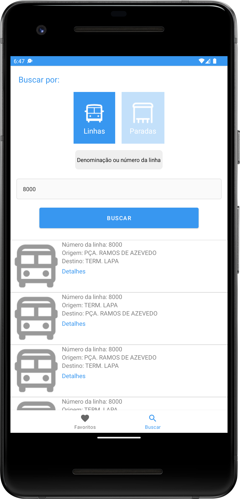
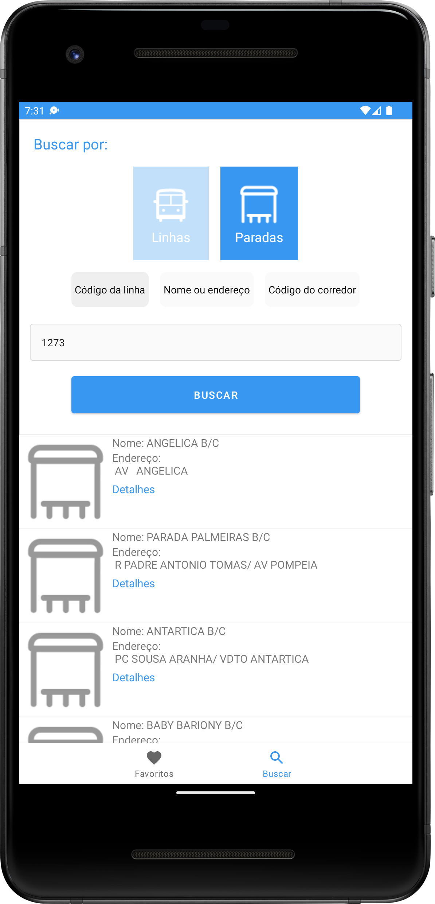
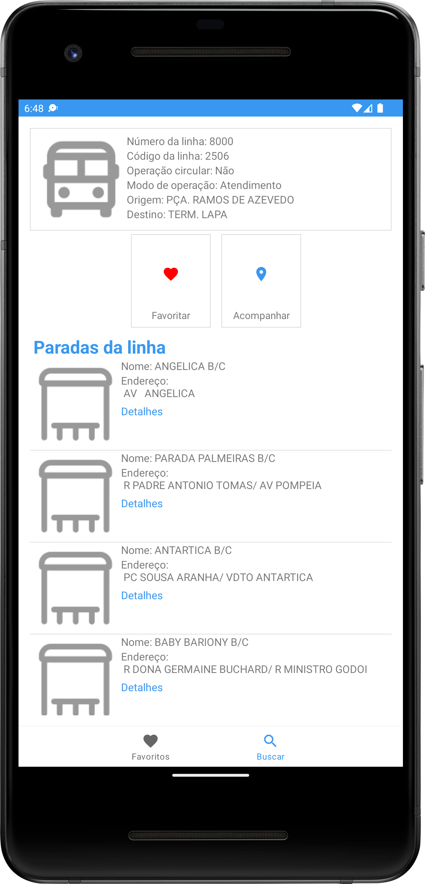
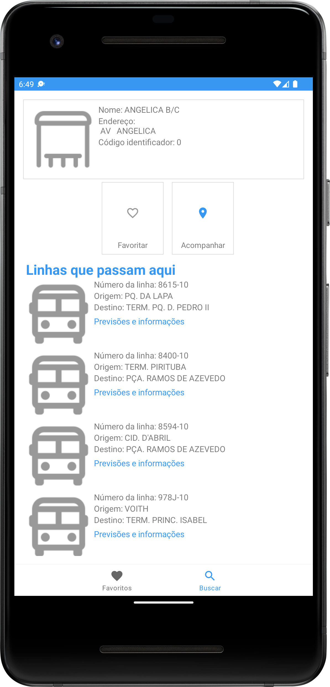
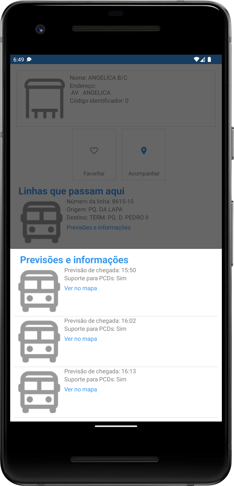
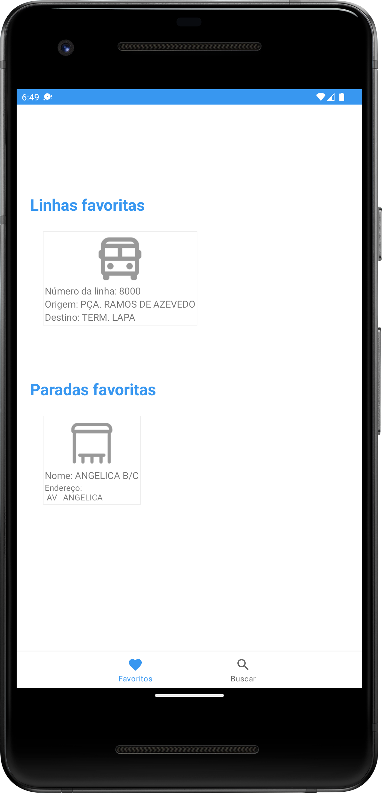

<h1 align="center">:oncoming_bus: DE OLHO NO BUS :oncoming_bus: </h1>

Tabela de conteúdos
=================
<!--ts-->
   * [Fotos](#screenshots-camera)
   * [Sobre](#sobre-book)
   * [Tecnologias](#tecnologias-rocket)
   * [Funções](#funções-hammer_and_wrench)
   * [Como rodar o projeto](#como-rodar-o-projeto-game_die) 
   * [Autor](#autor) 
<!--te-->

## Screenshots :camera: 
<h1 align="center">
  
  
  
  
  
  
  </h1>

## Sobre :book:
O aplicativo é capaz de trazer ao usuário informações relevantes das linhas e paradas de ônibus do Estado de São Paulo.

## Funções :hammer_and_wrench:
- [x] Buscar linhas por nome/número.
- [x] Detalhes de linhas e todas as paradas da mesma.
- [x] Mostrar no mapa as últimas localizações das linhas.
- [x] Previsões de chegada das linhas em cada ponto de parada.
- [x] Informa se as linhas tem suporte para PCDs.
- [x] Opção de favoritar linhas.
- [x] Buscar paradas por código de linha, nome/endereço ou código de corredor.
- [x] Detalhes de paradas e todas as linhas que passam por ela.
- [x] Mostrar no mapa as paradas.
- [x] Opção de favoritar paradas.

## Técnicas 🛠 
- [x] Integração REST com Retrofit + OkHttpClient.
- [x] Arquitetura MVVM.
- [x] Jetpack Components (ViewModel, LiveData, LifeCycle, Room, Data Binding, Navigation)
- [x] Injeção de dependências com Hilt.
- [x] Room para persistência de dados local;
- [x] Navigation Component para sistema de navegação de telas;
- [x] Higher Orders Functions.
- [x] Generics.
- [x] Inline Functions.

## Tecnologias :rocket:
As seguintes ferramentas foram utilizadas no desenvolvimento do projeto:
- [Kotlin](https://kotlinlang.org/)
- [Google Maps](https://mapsplatform.google.com/)
- [Retrofit](https://square.github.io/retrofit/)
- [OkHttpClient](https://square.github.io/okhttp/4.x/okhttp/okhttp3/-ok-http-client/)

## Como rodar o projeto :game_die:
Será necessário ter duas chaves de apis:  
CHAVE DE API DO OLHO VIVO que pode ser obtida [AQUI.](https://www.sptrans.com.br/desenvolvedores/api-do-olho-vivo-guia-de-referencia/)  
CHAVE DE API GOOGLE MAPS que pode ser obtida [AQUI.](https://mapsplatform.google.com/)  

Para rodar o aplicativo será necessário abri-lo no Android Studio, mas antes colocar suas chaves de api.  

Chave da API DO OLHO VIVO -> em com.andreesperanca.deolhonobus.util.ConstantsProject substitua da seguinte forma:  
const val API_KEY = "SUA_API_KEY"  

Chave do Google Maps -> em local.properties substitua da seguinte forma:   
MAPS_API_KEY = SUA_API_KEY  

## Autor
Feito por André Esperança!

Contatos :
 

<a href="https://github.com/andreesperanca">
   
 
  
  <a href="https://github.com/andreesperanca" title="">André Esperança</a>

